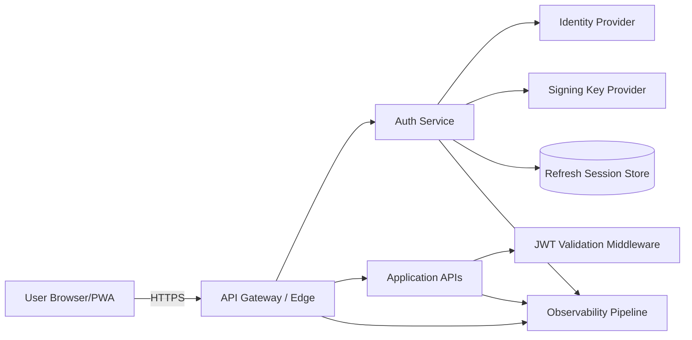
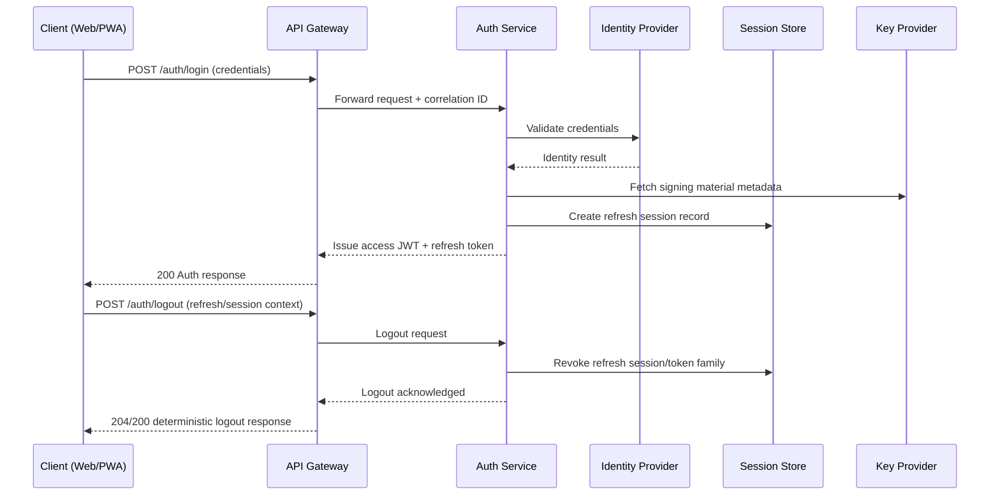
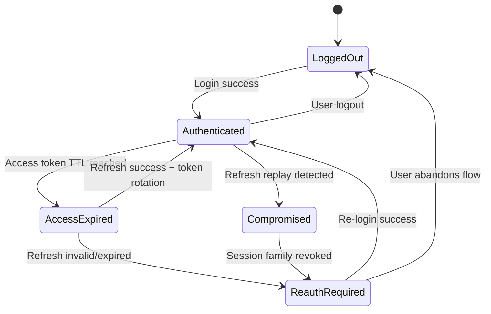
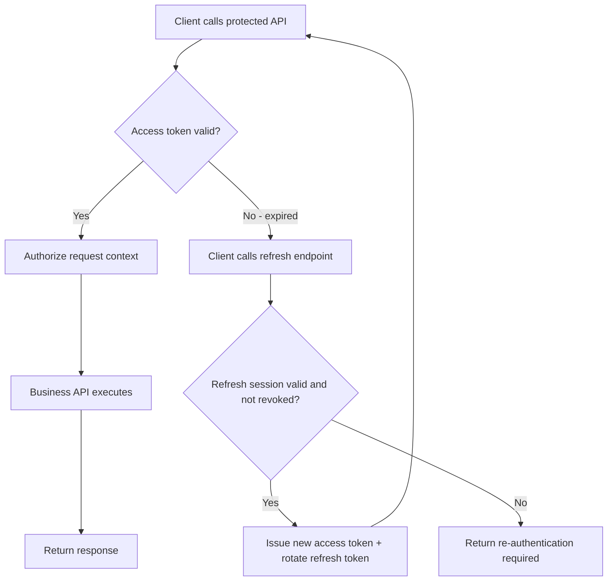

# Authentication System Technical Design

## Document Control

| Field | Value |
|---|---|
| Design Name | Authentication System (JWT + Refresh Session) |
| Design ID | AUTH-DESIGN-001 |
| Version | 1.0 |
| Status (Draft/Review/Approved) | Draft |
| Author | Architecture Team |
| Reviewers | Security Engineering, Platform, SRE, QA |
| Last Updated | 2026-05-28 |
| Related Spec IDs | AUTH-SPEC-001 |

## Design Summary

This design defines a cloud-native, security-first authentication architecture for a TypeScript-based web and PWA application. It uses short-lived JWT access tokens and rotating refresh tokens with server-side session control, while keeping request-serving services stateless for horizontal scalability. The design is AWS-compatible, CI/CD-friendly, observability-first, and prepared for future role-based authorization.

## Context and Constraints

| Topic | Details |
|---|---|
| Existing Architecture Context | Documentation-first repository with enterprise AI engineering and security rules. |
| Assumptions | TypeScript services, HTTPS-only traffic, managed cloud services, centralized logging/metrics/tracing. |
| Hard Constraints | Stateless access-token validation path, secure refresh lifecycle, no fail-open security behavior. |
| External Dependencies | Identity provider, managed key management, managed session store, observability platform. |

## Goals and Non-Goals

| Type | Description |
|---|---|
| Goals | Secure login/logout and token lifecycle with deterministic behavior across web and PWA clients. |
| Goals | Cloud-native scale with stateless APIs and managed state for refresh sessions only. |
| Goals | Clear observability and audit trails for auth lifecycle and security events. |
| Goals | Role claim readiness for future RBAC rollout. |
| Non-Goals | Full RBAC policy engine implementation in this phase. |
| Non-Goals | Social login, SSO federation, and MFA implementation in this phase. |

## High-Level Architecture

### Architecture Notes

- Authentication logic is centralized in an Auth Service domain boundary.
- Access-token verification is local (signature + claim checks), enabling stateless API scaling.
- Refresh-token session state is centralized in managed storage for revocation and replay protection.
- All components emit structured telemetry with shared correlation identifiers.

## Component Responsibilities

| Component | Responsibility | Stateless | AWS-Compatible Mapping |
|---|---|---|---|
| Browser/PWA Client | Initiate login/logout, store session state safely, handle token renewal workflow deterministically. | N/A | Web app + service worker runtime |
| API Gateway/Edge | TLS termination, request routing, baseline rate limiting, header normalization. | Yes | API Gateway / ALB + WAF |
| Auth Service | Credential exchange orchestration, token issuance, refresh rotation, revocation handling, audit events. | Yes (except externalized session state) | ECS/EKS/Lambda service |
| JWT Validation Middleware | Verify JWT signature, expiry, issuer/audience, and role claim schema. | Yes | In-service middleware/library |
| Refresh Session Store | Persist refresh token family metadata, revocation status, expiry, and replay signals. | No (managed stateful) | DynamoDB / ElastiCache (policy-based) |
| Signing Key Provider | Provide active signing keys and rotation metadata for JWT signing/verification. | Managed | AWS KMS + JWKS publishing layer |
| Observability Pipeline | Collect logs, metrics, traces, and security audit events. | Managed | CloudWatch + X-Ray + SIEM sink |

## Authentication Flow

## Token Lifecycle Flow

### Token Lifecycle Policies

| Policy Area | Design Decision |
|---|---|
| Access Token | Short TTL (environment-governed), signed JWT, no direct extension. |
| Refresh Token | Opaque or signed token linked to server session record. |
| Rotation | One-time-use refresh semantics with family tracking. |
| Revocation | Supported for logout, admin action, and suspected compromise. |
| Replay Detection | Reuse of invalidated refresh token triggers family revocation and security event. |
| Role Claim Readiness | Stable role claim namespace reserved even before RBAC enforcement. |

## API Interaction Flow

### API Interaction Requirements

| Area | Requirement |
|---|---|
| Protected APIs | Must validate JWT signature and mandatory claims on every request. |
| Error Semantics | Auth errors must be deterministic and machine-parseable for client behavior. |
| Idempotency | Refresh and logout endpoints must support idempotent client retries. |
| Correlation | Each auth interaction must carry correlation ID across gateway and services. |

## Security Architecture

| Control Domain | Design Requirement | Verification |
|---|---|---|
| Credential Handling | Credentials processed only in authentication boundary; never logged. | Security tests + log scanning |
| Token Integrity | JWT signed with managed keys; key rotation supported without downtime. | Cryptographic validation tests |
| Transport Security | TLS enforced end-to-end and secure transport headers applied. | Platform policy checks |
| Session Security | Refresh rotation, revocation, and replay detection mandatory. | Integration + abuse tests |
| Abuse Protection | Rate limits, anomaly detection, and lockout policy at edge/auth boundary. | Load + attack simulation |
| Least Privilege | Service roles scoped minimally for key/session/telemetry operations. | IAM review + policy lint |
| Auditability | Immutable security-relevant auth event trails retained per policy. | Audit pipeline validation |

## Storage Strategy

| Data Type | Storage | Retention | Notes |
|---|---|---|---|
| Refresh Session Metadata | Managed key-value store | TTL-aligned with session max age | Includes token family, status, device/session context hashes |
| Revocation Records | Managed key-value store | Session max age + audit buffer | Supports immediate invalidation checks |
| Audit Events | Central log + SIEM pipeline | Compliance-defined retention window | Tamper-evident controls required |
| Access Tokens | Not server-persisted for validation path | N/A | Stateless validation by signature and claims |

## Scalability Considerations

| Concern | Design Approach |
|---|---|
| Horizontal API Scale | Stateless JWT validation in each service instance. |
| Refresh Throughput | Partition session records by user/session family key; autoscale auth service. |
| Multi-Region Strategy | Regional auth endpoints with replicated or region-aware session strategy. |
| Burst Handling | Edge rate limiting + queue-free sync auth path with bounded retries. |
| Cold Start/Latency | Keep token signing and session checks optimized with managed service SLAs. |

## Monitoring and Logging Strategy

| Signal | Required Telemetry | SLO/Threshold | Alerting |
|---|---|---|---|
| Logs | Login, refresh, logout outcomes; revocation; replay detection; correlation ID | 100% structured auth events | Missing structured event ratio breach |
| Metrics | Success/failure rates, p95/p99 latency, token issuance rate, replay detections | Auth availability >= 99.95% monthly | Error budget burn, latency threshold breach |
| Traces | End-to-end spans across gateway, auth, session store, key service | Critical path trace coverage enforced | Missing critical spans, high-latency spans |
| Security Audit | Actor/action/resource/outcome/timestamp for auth-sensitive operations | Retention and integrity policy compliance | Audit ingestion delays and gaps |

## Deployment Considerations

### AWS Compatibility

| Area | Compatibility Guidance |
|---|---|
| Compute | Run Auth Service on ECS, EKS, or Lambda based on latency profile and team operations model. |
| Session Store | Use DynamoDB for durable session metadata with TTL and conditional writes. |
| Key Management | Use AWS KMS-backed signing key workflow with controlled rotation. |
| Edge Security | Use API Gateway/ALB with WAF rules and request throttling. |
| Telemetry | Use CloudWatch metrics/logs and distributed tracing integrated with incident tooling. |

### CI/CD Compatibility

| Pipeline Gate | Requirement |
|---|---|
| Security Gate | Block on critical vulnerabilities, secrets exposure, and policy violations. |
| Contract Gate | Validate auth API and claim contract changes for backward compatibility. |
| Test Gate | Require unit, integration, contract, E2E, and resilience test evidence. |
| Observability Gate | Ensure required telemetry fields and event schemas are present. |
| Release Gate | Progressive deployment with rollback automation and approval checkpoints. |

## Failure Handling Strategy

| Failure Scenario | Detection | System Behavior | Recovery |
|---|---|---|---|
| Identity provider outage | Elevated login error rate + dependency health check | Fail closed for new login; preserve existing valid sessions until expiry | Auto-retry with circuit breaker and incident escalation |
| Session store degradation | Timeout/error metrics and trace latency | Deterministic auth error on refresh; do not mint tokens without session validation | Retry with backoff and failover policy |
| Key provider failure | Signing/verification dependency alarm | Stop token issuance (fail closed), continue validating cached valid keys within strict window if policy allows | Restore key provider; rotate keys if integrity concern |
| Replay attack pattern | Reuse detection metric + audit event | Revoke affected token family and force re-authentication | Security incident workflow + monitoring hardening |
| Observability pipeline lag | Missing telemetry alerts | Continue auth operations while buffering where supported | Restore pipeline and backfill if required |

## Future Extensibility

| Extension Area | Design Hook Included Now | Future Outcome |
|---|---|---|
| RBAC | Reserved role claim schema and authorization context propagation | Enable endpoint and resource-level authorization policies |
| MFA | Challenge step integration point in login orchestration | Add stronger authentication for high-risk access |
| SSO/Federation | Identity provider abstraction boundary | Integrate enterprise IdPs with minimal auth-core changes |
| Adaptive Risk | Telemetry and audit signal standardization | Add risk-based authentication controls |
| Fine-Grained Session Controls | Session metadata model supports device/session attributes | Add selective device revocation and posture checks |

## AI-Assisted Design Controls

| Item | Requirement |
|---|---|
| AI-Assisted Artifacts Allowed | Architecture drafts, sequence/state diagrams, risk analysis tables |
| Mandatory Human Review Areas | Security controls, token/session lifecycle policy, failure mode decisions |
| Decision Logging Requirement | Record major trade-offs and approvals via ADR linked to this design |

## Open Questions

- Confirm baseline access and refresh TTL by environment tier (dev/stage/prod).
- Confirm multi-session policy (single device, capped concurrent sessions, or unlimited).
- Confirm region strategy for refresh session data consistency and failover behavior.
- Confirm regulatory retention windows for authentication audit records.
