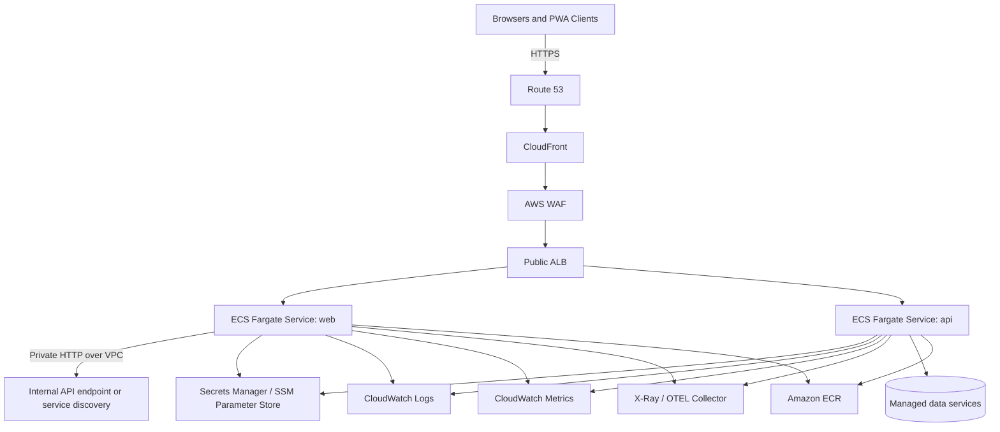

# AWS Production Readiness Architecture

## Document Control

| Field                          | Value                                                        |
| ------------------------------ | ------------------------------------------------------------ |
| Design Name                    | AWS Production Readiness Architecture                        |
| Design ID                      | PLATFORM-DESIGN-001                                          |
| Version                        | 1.0                                                          |
| Status (Draft/Review/Approved) | Draft                                                        |
| Author                         | Platform Architecture                                        |
| Reviewers                      | Security Engineering, SRE, Application Engineering, Platform |
| Last Updated                   | 2026-05-29                                                   |
| Related Spec IDs               | AUTH-SPEC-001                                                |

## Design Summary

This document defines a production-target AWS deployment architecture for the existing monorepo without provisioning resources yet. The design uses ECS Fargate for the Next.js frontend and NestJS backend, Application Load Balancers for ingress, environment-isolated AWS accounts or strong account boundaries, Terraform modules for reusable infrastructure composition, GitHub Actions for controlled deployments, and CloudWatch-centered observability aligned with the repository's security and observability standards.

## Context and Constraints

| Topic                         | Details                                                                                                                           |
| ----------------------------- | --------------------------------------------------------------------------------------------------------------------------------- |
| Existing Architecture Context | Turborepo monorepo with `apps/web`, `apps/api`, shared packages, and Terraform scaffold under `infrastructure/`.                  |
| Assumptions                   | Container images are built in CI, runtime secrets come from managed AWS services, and production traffic is HTTPS only.           |
| Hard Constraints              | Do not provision resources in this phase, preserve stateless service scaling, and keep secrets out of source and Terraform state. |
| External Dependencies         | GitHub Actions, Amazon ECR, ECS Fargate, ALB, VPC networking, Secrets Manager, CloudWatch, Route 53, ACM.                         |

## Goals and Non-Goals

| Type      | Description                                                                                                                      |
| --------- | -------------------------------------------------------------------------------------------------------------------------------- |
| Goals     | Define frontend and backend deployment strategy for AWS production readiness.                                                    |
| Goals     | Use ECS Fargate-based runtime architecture with ALB integration and secure networking boundaries.                                |
| Goals     | Establish reusable Terraform organization, environment isolation, CI/CD flow, rollback preparation, and observability readiness. |
| Goals     | Align production deployment planning with repository security, observability, and change-safety rules.                           |
| Non-Goals | Provisioning real AWS infrastructure in this change.                                                                             |
| Non-Goals | Selecting exact AWS account IDs, domains, or commercial support model details.                                                   |
| Non-Goals | Replacing the current placeholder identity flow with a production IdP integration in this document.                              |

## Architecture Overview

### Core Topology Decisions

| Area       | Decision                                                                                                       | Rationale                                                        |
| ---------- | -------------------------------------------------------------------------------------------------------------- | ---------------------------------------------------------------- |
| Compute    | Deploy `apps/web` and `apps/api` as separate ECS Fargate services.                                             | Independent scaling, release cadence, and fault isolation.       |
| Ingress    | Use ALB for HTTP routing and health-based target registration.                                                 | Native path-based routing, TLS termination, and ECS integration. |
| Edge       | Place CloudFront and WAF in front of the public ALB for caching, TLS policy enforcement, and edge protections. | Better global delivery and security controls for the frontend.   |
| Networking | Run tasks in private subnets; expose only ALB listeners publicly.                                              | Reduces attack surface and follows least-exposure principles.    |
| State      | Keep services stateless; push mutable session and app data to managed services.                                | Aligns with architecture principles and Fargate scaling.         |
| Images     | Build immutable container images and store in ECR with commit-SHA tags.                                        | Supports promotion, rollback, and supply-chain traceability.     |

## Deployment Architecture

### Frontend Deployment Strategy

| Topic            | Guidance                                                                                                  |
| ---------------- | --------------------------------------------------------------------------------------------------------- |
| Runtime          | Package `apps/web` as a production Next.js container and run it as its own ECS Fargate service.           |
| Ingress Path     | Route public traffic through CloudFront and a public ALB listener to the web target group.                |
| Scaling          | Scale on request count per target, CPU, memory, and latency saturation.                                   |
| Session Handling | Keep access tokens in memory and refresh tokens in HttpOnly cookies; do not use task-local session state. |
| Static Assets    | Serve `_next/static` and other cacheable assets through CloudFront with cache-control policies.           |
| TLS              | Terminate TLS at CloudFront and ALB with ACM-managed certificates.                                        |
| Availability     | Run at least two tasks across multiple AZs in staging and production.                                     |

### Backend Deployment Strategy

| Topic             | Guidance                                                                                                    |
| ----------------- | ----------------------------------------------------------------------------------------------------------- |
| Runtime           | Package `apps/api` as a separate ECS Fargate service behind the same or a dedicated ALB listener rule set.  |
| Exposure          | Prefer path-based routing from ALB for `/api/*`; keep containers in private subnets.                        |
| Scaling           | Scale on CPU, memory, request count, p95 latency, and auth/error-rate alarms.                               |
| Dependency Access | Use VPC endpoints or NAT-backed egress for AWS services such as Secrets Manager, CloudWatch, and ECR pulls. |
| Health Behavior   | Use distinct liveness and readiness endpoints and ALB target group health checks.                           |
| Resilience        | Keep request handlers stateless and dependency timeouts explicit to support rapid task replacement.         |

### ECS Fargate Architecture

| Concern               | Production Readiness Guidance                                                                                                      |
| --------------------- | ---------------------------------------------------------------------------------------------------------------------------------- |
| Cluster Model         | Use one ECS cluster per environment or per account/environment boundary for simplified isolation.                                  |
| Task Definition       | Separate task definitions for `web` and `api`, with environment-specific CPU, memory, log config, and secrets injection.           |
| Capacity              | Start with Fargate On-Demand for predictability; evaluate Fargate Spot only for non-production background workloads.               |
| Deployment Controller | Use ECS rolling deployments first; keep blue/green with CodeDeploy as a future enhancement if stricter zero-downtime needs emerge. |
| Service Discovery     | Use ALB target groups for north-south traffic; add Cloud Map only if east-west service discovery becomes necessary.                |
| Runtime Hardening     | Use read-only root filesystem where feasible, drop unused Linux capabilities, and run non-root images when supported.              |

### ALB Integration

| Area              | Guidance                                                                                                      |
| ----------------- | ------------------------------------------------------------------------------------------------------------- |
| Listener Strategy | `443` HTTPS listener with redirect from `80`; path-based routing for `/api/*` to backend and `/` to frontend. |
| Health Checks     | Configure health checks per target group using app-specific readiness paths and conservative thresholds.      |
| Stickiness        | Avoid session stickiness because application state must remain externalized.                                  |
| Access Logs       | Enable ALB access logging to S3 with retention and lifecycle policies.                                        |
| Header Policy     | Preserve `x-correlation-id`, `x-forwarded-*`, and trace propagation headers end to end.                       |
| Protection        | Front the ALB with WAF-managed rule groups and environment-specific allowlists if admin surfaces exist.       |

## VPC and Networking Considerations

| Topic           | Guidance                                                                                                                   |
| --------------- | -------------------------------------------------------------------------------------------------------------------------- |
| VPC Layout      | Use one VPC per environment with at least two public and two private subnets across separate AZs.                          |
| Public Subnets  | Limit public resources to ALBs and NAT gateways; no ECS tasks should receive public IPs in staging or production.          |
| Private Subnets | Place ECS tasks, internal data services, and OTEL collectors in private subnets.                                           |
| Egress          | Prefer VPC endpoints for AWS APIs where available to reduce NAT dependency and tighten egress control.                     |
| Security Groups | Separate ALB, frontend task, backend task, and data-service security groups with least-privilege ingress rules.            |
| Network ACLs    | Keep NACLs simple and stateless only where policy requires; rely primarily on security groups for least-privilege control. |
| DNS             | Use Route 53 hosted zones with environment-specific subdomains such as `app.dev`, `app.staging`, `app.example.com`.        |
| TLS             | Use ACM certificates and modern TLS policies; disable plain HTTP except for redirect behavior.                             |

## Environment Isolation Strategy

| Environment | Isolation Guidance                                                                                   | Purpose                                      |
| ----------- | ---------------------------------------------------------------------------------------------------- | -------------------------------------------- |
| Development | Separate account preferred; otherwise isolated VPC, ECS cluster, state, secrets, and CI environment. | Fast iteration and safe experimentation.     |
| Staging     | Dedicated account strongly recommended with production-like controls and restricted access.          | Pre-production validation and approval gate. |
| Production  | Dedicated account with tighter SCPs, break-glass controls, and minimal human write access.           | Customer-facing runtime.                     |

### Isolation Rules

- Use separate Terraform state, IAM roles, secrets, ECR deployment permissions, and CloudWatch log groups per environment.
- Prevent direct promotion of mutable environment configuration; promote immutable artifacts and approved IaC changes instead.
- Restrict production access to deployment roles and audited break-glass procedures.

## Scalability Considerations

| Concern                | Guidance                                                                                             |
| ---------------------- | ---------------------------------------------------------------------------------------------------- |
| Horizontal Scale       | Keep both services stateless and scale task count independently.                                     |
| Startup Time           | Optimize container startup and health check grace periods to reduce deployment churn.                |
| Frontend Burst Traffic | Use CloudFront caching and multiple web tasks across AZs.                                            |
| API Burst Traffic      | Use ECS target tracking on request count and CPU, plus rate limiting at WAF/ALB boundaries.          |
| Data Dependencies      | Choose managed backing services that can scale independently and expose clear SLOs.                  |
| Background Operations  | Offload future asynchronous work to SQS-driven workers instead of overloading request-serving tasks. |

## Terraform Production Structure

| Layer                             | Responsibility                                                                          |
| --------------------------------- | --------------------------------------------------------------------------------------- | ------------ | -------------------------------------------------------------------------------- |
| Root `infrastructure/`            | Shared provider, backend, tagging, and composition interfaces.                          |
| `modules/network/`                | VPC, subnets, NAT, route tables, VPC endpoints, security group primitives.              |
| `modules/security-baseline/`      | IAM boundaries, KMS keys, WAF hooks, secret access policies, security logging defaults. |
| `modules/observability-baseline/` | CloudWatch log groups, metric filters, alarms, dashboards, tracing hooks.               |
| `modules/compute-baseline/`       | ECS cluster, task execution patterns, service definitions, target groups, autoscaling.  |
| `environments/dev                 | staging                                                                                 | production/` | Environment wrappers that compose modules with environment-specific values only. |

## Remote State Strategy

| Topic            | Guidance                                                                                                                                   |
| ---------------- | ------------------------------------------------------------------------------------------------------------------------------------------ |
| Backend          | Use an S3 backend with versioning, encryption, bucket policy restrictions, and state locking via DynamoDB or equivalent lock coordination. |
| Isolation        | Use a separate state bucket prefix and lock table entries per environment and per root stack where appropriate.                            |
| Access           | Permit only CI deployment roles and tightly controlled platform-admin roles to read/write state.                                           |
| Protection       | Enable bucket versioning, lifecycle retention, and access logging for auditability.                                                        |
| Promotion Safety | Never share a state file between environments.                                                                                             |

## Secrets Management Architecture

| Area            | Guidance                                                                                                                            |
| --------------- | ----------------------------------------------------------------------------------------------------------------------------------- |
| Runtime Secrets | Store application secrets in AWS Secrets Manager; use SSM Parameter Store only for low-sensitivity configuration where appropriate. |
| Injection       | Inject secrets into ECS tasks through task definition secret references, not baked container env files.                             |
| Rotation        | Design secrets for rotation without image rebuilds; document service restart behavior for rotated values.                           |
| Terraform       | Keep secret values out of Terraform variables, plans, state, and docs.                                                              |
| Access          | Grant read access only to the specific task roles and CI roles that need each secret.                                               |

## IAM Role Strategy

| Role Type                   | Purpose                                                                   | Guidance                                                                           |
| --------------------------- | ------------------------------------------------------------------------- | ---------------------------------------------------------------------------------- |
| GitHub OIDC deployment role | Assumed by GitHub Actions for plan/apply and deployment steps.            | Separate role per environment with repo, branch, and workflow conditions.          |
| ECS task execution role     | Pull images and push logs.                                                | Keep limited to ECR read, CloudWatch logs write, and secret fetch bootstrap needs. |
| ECS task role for web       | Access runtime config and telemetry sinks only.                           | No broad AWS admin permissions.                                                    |
| ECS task role for api       | Access app-specific secrets, telemetry, and future managed data services. | Scope by ARN and action; deny wildcard permissions wherever possible.              |
| Break-glass admin role      | Emergency remediation with strong audit trail.                            | MFA, short session duration, manual approval, and monitored usage.                 |

## CI/CD Architecture Summary

| Stage             | Outcome                                                                                                                          |
| ----------------- | -------------------------------------------------------------------------------------------------------------------------------- |
| Pull Request      | Lint, test, build, container scan, Terraform validation, and documentation review.                                               |
| Main Branch Build | Produce immutable web and api images, sign or attest them if policy requires, and publish to ECR.                                |
| Staging Deploy    | Apply reviewed infrastructure deltas if needed, deploy pinned images, and run smoke validation.                                  |
| Production Deploy | Reuse the same approved image digests, require manual approval, then deploy with post-deploy validation and rollback guardrails. |

## Observability Readiness

| Signal     | AWS Readiness Guidance                                                                                                     |
| ---------- | -------------------------------------------------------------------------------------------------------------------------- |
| Logs       | Use structured JSON logs to CloudWatch Logs with environment, service, version, correlation ID, and request metadata.      |
| Metrics    | Export application and platform metrics to CloudWatch with low-cardinality dimensions.                                     |
| Traces     | Prepare for X-Ray or OTEL collector export; preserve W3C trace context between frontend, backend, and downstream services. |
| Alerts     | Define CloudWatch alarms for latency, 5xx rate, auth failures, task restarts, and health check failures.                   |
| Dashboards | Create service dashboards for golden signals, auth flows, ALB status codes, and ECS resource saturation.                   |

## Security Considerations

| Control Area        | Requirement                                                                                | Verification                                      |
| ------------------- | ------------------------------------------------------------------------------------------ | ------------------------------------------------- |
| Secrets Management  | Secrets only in managed stores with runtime retrieval.                                     | Terraform review, CI secret scanning, IAM review. |
| Least Privilege IAM | Roles scoped by environment, service, and action.                                          | IAM policy review and simulation.                 |
| Secure Networking   | Private task networking, least-privilege SG rules, WAF, and TLS-only ingress.              | Architecture review and deployment validation.    |
| HTTPS/TLS           | ACM certificates, TLS 1.2+ policies, redirect from HTTP to HTTPS.                          | ALB/CloudFront listener validation.               |
| Container Security  | Minimal base images, pinned dependencies, image scanning, non-root runtime where feasible. | CI scan results and runtime config review.        |

## Operational Readiness

| Area              | Guidance                                                                                                                               |
| ----------------- | -------------------------------------------------------------------------------------------------------------------------------------- |
| Health Checks     | Provide liveness and readiness endpoints for each service and wire them into ECS and ALB health checks.                                |
| Rollback          | Keep previous stable task definition and image digest ready for fast service rollback.                                                 |
| Disaster Recovery | Document recovery objectives, state dependencies, backup expectations, and cross-region recovery assumptions before production launch. |
| Scaling           | Define min/max task counts and autoscaling policies per environment and revisit after load testing.                                    |
| Troubleshooting   | Start with correlation ID, ALB logs, CloudWatch Logs Insights, ECS events, and dependency health dashboards.                           |

## Rollout and Rollback Plan

| Stage                   | Entry Criteria                                             | Exit Criteria                                           | Rollback Trigger                            |
| ----------------------- | ---------------------------------------------------------- | ------------------------------------------------------- | ------------------------------------------- |
| Staging Deployment      | CI green, image digests published, Terraform plan reviewed | Smoke, health, and auth flow validation pass            | Staging smoke or health failure             |
| Production Canary       | Manual approval, staging stable, rollback plan confirmed   | Error rate, latency, and saturation within thresholds   | Alarm breach, elevated 5xx, auth regression |
| Production Full Rollout | Canary stable for agreed window                            | All target groups healthy and business smoke tests pass | Any severe customer-facing regression       |

## Risks and Mitigations

| Risk                                     | Likelihood | Impact | Mitigation                                                                              |
| ---------------------------------------- | ---------- | ------ | --------------------------------------------------------------------------------------- |
| Shared-environment drift                 | Medium     | High   | Use separate accounts, state, IAM, and secrets per environment.                         |
| Overly broad IAM roles                   | Medium     | High   | Enforce policy review, scoped roles, and OIDC trust conditions.                         |
| Runtime secret leakage                   | Low-Med    | High   | Use managed stores, structured log redaction, and CI secret scanning.                   |
| ALB misrouting or poor health thresholds | Medium     | Medium | Validate listener rules and use service-specific readiness behavior.                    |
| Incomplete telemetry at launch           | Medium     | High   | Add telemetry validation to deployment workflow and stage dashboards before production. |

## Open Questions

- Confirm whether production will use a single public ALB or separate ALBs for web and api.
- Confirm whether CloudFront will front both static and dynamic web traffic in the first production release.
- Confirm the target managed data services backing the API beyond authentication.
- Confirm account vending and organization policy model for dev, staging, and production.
