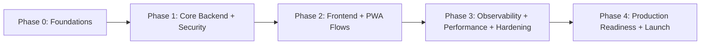

# Authentication System Implementation Plan

## Document Control

| Field | Value |
|---|---|
| Plan Name | Authentication System Implementation Plan |
| Plan ID | AUTH-PLAN-001 |
| Version | 1.0 |
| Status | Draft |
| Owner | Engineering Manager (Auth Domain) |
| Contributors | Frontend, Backend, Platform, Security, QA, SRE |
| Last Updated | 2026-05-28 |
| Source References | AUTH-SPEC-001, AUTH-DESIGN-001, AUTH-API-001 |

## Delivery Objective

Deliver a production-ready authentication system for TypeScript web/PWA clients with JWT access tokens, rotating refresh tokens, secure session lifecycle, observability-first operations, AWS deployment compatibility, and CI/CD quality gates.

## Delivery Principles

- Security-first defaults, fail-closed behavior.
- Contract-first implementation from approved API spec.
- Stateless backend request path for access-token validation.
- Deterministic behavior for PWA lifecycle and token expiration.
- Progressive delivery with explicit rollback controls.

## Phase Plan and Sequencing

## Phase Summary

| Phase | Outcome | Primary Owners | Exit Gate |
|---|---|---|---|
| Phase 0 | Environments, CI/CD scaffolding, security baseline, test strategy activated | Platform, Security, QA | All gates green for initial pipeline |
| Phase 1 | Auth backend and token lifecycle complete per API contract | Backend, Security | Contract + integration + security tests pass |
| Phase 2 | Web/PWA auth UX flows complete and deterministic | Frontend, QA | E2E auth journeys pass including offline/resume |
| Phase 3 | Observability, load/resilience validation, risk hardening | SRE, Backend, Security | SLO and resilience criteria met |
| Phase 4 | Production launch readiness, rollback and support playbooks finalized | EM, SRE, Security, Product | Go-live checklist approved |

## Dependency Map

| Dependency ID | Depends On | Required For | Type |
|---|---|---|---|
| DEP-01 | Auth API contract finalized | Backend endpoint implementation | External contract |
| DEP-02 | KMS/JWKS and session store provisioning | Token signing and refresh lifecycle | Infrastructure |
| DEP-03 | CI/CD security and test gates | Safe merge and release flow | Process |
| DEP-04 | Backend auth endpoints | Frontend integration and PWA state handling | Service integration |
| DEP-05 | Telemetry schema and dashboards | SRE alerting and production readiness | Observability |
| DEP-06 | Failure playbooks and rollback paths | Launch approval | Operational |

## Epics, User Stories, and Engineering Tasks

## Epic E1: Platform and Security Foundations

### User Stories

| Story ID | User Story | Priority |
|---|---|---|
| E1-US1 | As a platform engineer, I want AWS-compatible auth infrastructure so services can run securely at scale. | P0 |
| E1-US2 | As a security engineer, I want baseline security controls enforced in CI/CD so insecure changes cannot merge. | P0 |
| E1-US3 | As a QA lead, I want deterministic test scaffolding so auth behavior is reliably validated. | P0 |

### Engineering Tasks and Subtasks

| Task ID | Task | Subtasks | Dependencies | Owner |
|---|---|---|---|---|
| E1-T1 | Provision auth infrastructure baseline | Define IaC modules; create session store with TTL; configure KMS key policies; wire secret management | DEP-02 | Platform |
| E1-T2 | Configure gateway security baseline | Enable TLS policies; set WAF/rate-limit rules; enforce correlation headers | DEP-01 | Platform/Security |
| E1-T3 | Enable CI/CD quality gates | Add lint/test/security/contract gates; block critical vulns; add policy checks | DEP-03 | Platform |
| E1-T4 | Establish test framework baseline | Seed deterministic fixtures; define integration env strategy; add contract verification stage | DEP-03 | QA/Backend |

### Acceptance Criteria

- Infrastructure components required by auth design are provisioned and access-controlled.
- CI/CD blocks merges on critical security and contract failures.
- Deterministic test environments exist for integration and contract test execution.

---

## Epic E2: Backend Authentication and Token Lifecycle

### User Stories

| Story ID | User Story | Priority |
|---|---|---|
| E2-US1 | As a user, I want secure login so I can receive valid access and refresh tokens. | P0 |
| E2-US2 | As a user, I want token refresh so my session can continue securely. | P0 |
| E2-US3 | As a user, I want logout so active refresh sessions are revoked. | P0 |
| E2-US4 | As a platform team member, I want role-ready claims so future RBAC can be enabled safely. | P1 |

### Engineering Tasks and Subtasks

| Task ID | Task | Subtasks | Dependencies | Owner |
|---|---|---|---|---|
| E2-T1 | Implement login contract behavior | Validate request schema; authenticate via identity backend; mint JWT access token; create refresh session; emit audit events | DEP-01, DEP-02 | Backend |
| E2-T2 | Implement refresh flow | Validate refresh token/session binding; enforce rotation; detect replay; revoke family on replay | DEP-01, DEP-02 | Backend/Security |
| E2-T3 | Implement logout/session revoke flow | Enforce auth checks; revoke session(s); guarantee idempotent behavior; emit revocation events | DEP-01 | Backend |
| E2-T4 | Implement session validation endpoint | Validate JWT claims/signature; return role-ready session context; enforce deterministic errors | DEP-01 | Backend |
| E2-T5 | Error model and consistency | Implement problem+json mapping; sanitize security-sensitive details; map retryable semantics | DEP-01 | Backend/Security |

### Acceptance Criteria

- All auth endpoints conform to API contract request/response and status code definitions.
- Refresh rotation and replay detection work as specified.
- Logout revokes session state and repeat calls remain safe/idempotent.
- Standard error model is consistent and does not leak sensitive internals.

---

## Epic E3: Frontend and PWA Authentication Experience

### User Stories

| Story ID | User Story | Priority |
|---|---|---|
| E3-US1 | As a user, I want a reliable login/logout experience across browser and PWA. | P0 |
| E3-US2 | As a PWA user, I want deterministic auth behavior on resume/offline transitions. | P1 |
| E3-US3 | As a user, I want seamless token renewal until session expiry. | P0 |

### Engineering Tasks and Subtasks

| Task ID | Task | Subtasks | Dependencies | Owner |
|---|---|---|---|---|
| E3-T1 | Integrate login/logout API flows | Build request/response handlers; map error codes to UX states; clear session state on logout | DEP-04 | Frontend |
| E3-T2 | Implement token renewal orchestration | Add pre-expiry refresh trigger; handle refresh failure path; force re-auth state deterministically | DEP-04 | Frontend |
| E3-T3 | PWA lifecycle handling | Handle app resume; offline retry backoff; prevent refresh loops; restore session state safely | DEP-04 | Frontend |
| E3-T4 | Role-ready client context | Store and expose role claims for downstream authorization checks (future-ready) | DEP-04 | Frontend |

### Acceptance Criteria

- Browser and PWA clients complete login, refresh, logout, and session validation flows successfully.
- Expiry and refresh failures transition user to deterministic re-authentication behavior.
- PWA offline/resume flows avoid ambiguous auth states and infinite retries.

---

## Epic E4: Observability, Reliability, and Security Hardening

### User Stories

| Story ID | User Story | Priority |
|---|---|---|
| E4-US1 | As an SRE, I want full auth telemetry so incidents are detected and triaged quickly. | P0 |
| E4-US2 | As a security analyst, I want replay and abuse signals so suspicious activity is actionable. | P0 |
| E4-US3 | As an engineering team, we want resilience confidence under dependency failure. | P0 |

### Engineering Tasks and Subtasks

| Task ID | Task | Subtasks | Dependencies | Owner |
|---|---|---|---|---|
| E4-T1 | Implement telemetry schema | Emit structured logs with correlation IDs; publish auth metrics; instrument traces on critical paths | DEP-05 | Backend/SRE |
| E4-T2 | Build dashboards and alerts | SLO dashboards; error budget alerts; replay detection alerts; dependency latency alarms | DEP-05 | SRE |
| E4-T3 | Security hardening and abuse controls | Tune rate limits; lockout policy; verify least-privilege IAM; audit trail validation | DEP-02, DEP-05 | Security/Platform |
| E4-T4 | Resilience and failure tests | Execute outage drills (IdP/session store/KMS); verify fail-closed behavior and recovery runbooks | DEP-05 | SRE/QA |

### Acceptance Criteria

- Required auth events and metrics are present, queryable, and alerting correctly.
- Security controls meet policy (rate limits, replay handling, least privilege).
- Resilience tests demonstrate expected degraded/fail-closed behaviors.

---

## Epic E5: Release, Rollback, and Production Readiness

### User Stories

| Story ID | User Story | Priority |
|---|---|---|
| E5-US1 | As a release manager, I want progressive rollout controls to reduce launch risk. | P0 |
| E5-US2 | As on-call operations, I want rollback playbooks so incidents can be mitigated rapidly. | P0 |
| E5-US3 | As product leadership, I want go-live criteria to ensure launch quality and compliance. | P0 |

### Engineering Tasks and Subtasks

| Task ID | Task | Subtasks | Dependencies | Owner |
|---|---|---|---|---|
| E5-T1 | Define rollout strategy | Stage rollout waves; enable feature flags/config toggles; define canary thresholds | DEP-06 | EM/SRE |
| E5-T2 | Build rollback runbooks | Token config rollback; gateway policy rollback; session store rollback/fallback actions | DEP-06 | SRE/Platform |
| E5-T3 | Conduct production readiness review | Validate security, observability, performance, support model, and compliance artifacts | DEP-06 | EM/Security/SRE/QA |
| E5-T4 | Launch and hypercare | Execute go-live checklist; monitor launch dashboard; run incident command protocol if needed | DEP-06 | Cross-functional |

### Acceptance Criteria

- Rollout and rollback procedures are tested in pre-production.
- Launch gates are approved by Product, Engineering, Security, and SRE.
- Hypercare period has defined ownership, SLIs, and escalation paths.

## Implementation Sequencing (Sprint-Oriented)

| Sprint Window | Focus | Target Epics |
|---|---|---|
| Sprint 1 | Foundations and pipeline gates | E1 |
| Sprint 2 | Core login/refresh/logout/session backend | E2 |
| Sprint 3 | Frontend/PWA integration and core E2E | E3 |
| Sprint 4 | Observability, resilience, and security hardening | E4 |
| Sprint 5 | Production readiness, rollout, and launch | E5 |

## Risk Areas and Mitigations

| Risk ID | Risk Area | Impact | Likelihood | Mitigation | Owner |
|---|---|---|---|---|---|
| R-01 | Refresh token replay handling gaps | High | Medium | Mandatory replay tests + family revocation verification | Security/Backend |
| R-02 | PWA auth state inconsistency | Medium | Medium | Deterministic state transitions + offline/resume E2E tests | Frontend/QA |
| R-03 | KMS/session store dependency instability | High | Low-Med | Circuit-breakers, retries with backoff, fail-closed policies | Platform/SRE |
| R-04 | Incomplete observability at launch | High | Medium | Telemetry gate in CI/CD + pre-prod alert drills | SRE |
| R-05 | Contract drift between FE and BE | Medium | Medium | Contract tests in pipeline + schema compatibility checks | Backend/Frontend |

## Rollback Considerations

| Rollback Trigger | Rollback Action | Validation |
|---|---|---|
| Elevated auth failure rate post-release | Revert to previous auth service version; maintain previous token validation config | Error rate and login success recover within threshold |
| Replay/abuse anomaly spike | Tighten gateway policy/rate limits; revoke affected token families | Replay alerts return to baseline |
| Session store degradation | Activate fallback degradation path (deny refresh safely, preserve active access tokens until expiry) | Controlled failure semantics observed |
| PWA client regression | Roll back client release/feature flag for renewal orchestration | E2E smoke passes and support incidents drop |

## Observability Tasks (Detailed)

| Task | Deliverable | Done Criteria |
|---|---|---|
| Define auth event schema | Event catalog for login/refresh/logout/session and security outcomes | Catalog approved and versioned |
| Instrument key metrics | Success/failure rates, p95/p99 latency, replay count, dependency health | Dashboards display all required metrics |
| Distributed tracing | Traces across gateway -> auth -> store -> key provider | Critical path trace coverage verified |
| Alerting and runbooks | Alert rules + on-call triage procedures | Alert drill completed with acceptable MTTR |

## Production Readiness Checklist

- Security: Threat controls verified, IAM least privilege reviewed, secret handling compliant.
- Reliability: Resilience tests passed for dependency outages and degraded modes.
- Performance: Login/refresh/logout meet p95 targets under representative load.
- Observability: Logs, metrics, traces, and audit events validated end-to-end.
- Compliance: Audit retention and event integrity requirements satisfied.
- Operations: Runbooks, rollback plans, and on-call ownership confirmed.
- Release: Canary thresholds and stop conditions defined and approved.

## Testing Expectations

| Test Layer | Minimum Expectation | Exit Criteria |
|---|---|---|
| Unit | Core token/session logic, claim validation, and error mapping covered | Stable and deterministic in CI |
| Integration | Identity backend, key management, session store, and revocation flows | All critical integration paths green |
| Contract | Endpoint schemas/status/error model match AUTH-API-001/OpenAPI | No contract drift detected |
| End-to-End | Critical web + PWA auth journeys | Login/refresh/logout/session flows pass consistently |
| Security | Replay, brute force, token misuse, and authorization boundary tests | No critical/high unresolved findings |
| Performance | p95 latency and throughput against expected load | Meets SLO targets and error budgets |
| Resilience | Dependency failure and recovery scenarios | Fail-closed behavior and recovery verified |

## Definition of Done

A work item is complete only when:

- Implementation aligns with approved spec, design, and API contract.
- Required tests for its risk level pass with evidence in PR.
- Security and observability requirements are implemented and verified.
- Backward compatibility impact is assessed and documented.
- Rollback impact is documented for release-affecting changes.
- Documentation and traceability links are updated.
- PR is reviewed by required owners and all CI/CD gates pass.

## Agile Tracking Model

| Artifact | Convention |
|---|---|
| Epic IDs | `AUTH-E#` |
| Story IDs | `AUTH-E#-US#` |
| Task IDs | `AUTH-E#-T#` |
| Subtasks | Tracked as checklist items under task |
| Sprint Labels | `auth-sprint-#` |
| Risk Labels | `risk:security`, `risk:reliability`, `risk:performance` |

## Recommended First Backlog Slice

1. `AUTH-E1-US1`: Provision session store, key management, and gateway baseline.
2. `AUTH-E1-US2`: Enable CI/CD security + contract + test gates.
3. `AUTH-E2-US1`: Implement login endpoint behavior per contract.
4. `AUTH-E2-US2`: Implement refresh rotation and replay detection.
5. `AUTH-E2-US3`: Implement logout and session validation.
