# AWS Deployment Workflow

## Document Control

| Field             | Value                                  |
| ----------------- | -------------------------------------- |
| Plan Name         | AWS Deployment Workflow                |
| Plan ID           | PLATFORM-PLAN-001                      |
| Version           | 1.0                                    |
| Status            | Draft                                  |
| Owner             | Platform Engineering                   |
| Contributors      | Security, SRE, Application Engineering |
| Last Updated      | 2026-05-29                             |
| Source References | PLATFORM-DESIGN-001, AUTH-SPEC-001     |

## Objective

Define a production-ready GitHub Actions deployment workflow for the monorepo that supports environment-based deployments, approval gates, rollback preparation, immutable artifacts, and post-deployment validation without provisioning resources in this change.

## Workflow Principles

- Build once and promote immutable artifacts across environments.
- Separate artifact creation from deployment approval.
- Require stronger approval and narrower IAM permissions as the environment becomes more sensitive.
- Fail fast on security, test, or observability readiness gaps.
- Keep rollback paths operationally simple and pre-validated.

## Target GitHub Actions Strategy

| Workflow                | Trigger                                                | Outcome                                                                            |
| ----------------------- | ------------------------------------------------------ | ---------------------------------------------------------------------------------- |
| `ci.yml`                | Pull requests and pushes to `main`                     | Lint, test, build, IaC validation, image build verification, security scanning.    |
| `release-artifacts.yml` | Push to `main` after CI success                        | Build and push immutable `web` and `api` images to ECR with SHA and semantic tags. |
| `deploy-staging.yml`    | Manual dispatch or post-artifact promotion from `main` | Deploy reviewed image digests to staging and run smoke checks.                     |
| `deploy-production.yml` | Manual dispatch from approved release candidate        | Deploy the same digests to production after required approvals.                    |

## Environment-Based Deployments

| Environment | Source                                                                                | Approval Model                                                    | Deployment Behavior                                             |
| ----------- | ------------------------------------------------------------------------------------- | ----------------------------------------------------------------- | --------------------------------------------------------------- |
| Development | Latest successful `main` artifacts or short-lived feature environments if added later | Lightweight                                                       | Fast iteration, automated deployment optional.                  |
| Staging     | Promoted artifact manifest from `main`                                                | Platform or release owner approval                                | Mandatory smoke checks and observability validation.            |
| Production  | Previously validated staging artifact manifest                                        | Manual approvals from release, platform, and security as required | Controlled rollout with stop conditions and rollback readiness. |

## Artifact Strategy

| Artifact               | Format                                                                                          | Retention                          | Notes                                       |
| ---------------------- | ----------------------------------------------------------------------------------------------- | ---------------------------------- | ------------------------------------------- |
| Web container          | ECR image tagged by commit SHA and release tag                                                  | Per retention policy               | Deploy by image digest, not mutable tag.    |
| API container          | ECR image tagged by commit SHA and release tag                                                  | Per retention policy               | Deploy by image digest, not mutable tag.    |
| Release manifest       | JSON or YAML artifact listing commit SHA, image digests, infra module version, and env metadata | Long enough for rollback and audit | Primary promotion unit across environments. |
| Terraform plan summary | Artifact attached to deployment review                                                          | Short retention plus audit needs   | Human review aid, not a promotion artifact. |
| SBOM and scan results  | Build artifact                                                                                  | Per compliance and audit policy    | Supports supply-chain review.               |

## Approval Gates

| Gate                   | Environment            | Requirement                                                                                                |
| ---------------------- | ---------------------- | ---------------------------------------------------------------------------------------------------------- |
| CI Gate                | All                    | Lint, unit/integration tests, build, image scan, secrets scan, Terraform validate, and policy checks pass. |
| Staging Gate           | Staging                | Artifact manifest approved and deploy window confirmed.                                                    |
| Production Change Gate | Production             | GitHub environment approvals plus release checklist sign-off.                                              |
| Security Gate          | Production             | No unresolved critical vulnerabilities or secret-handling policy violations.                               |
| Observability Gate     | Staging and Production | Required dashboards, alarms, and health endpoints validated for the candidate release.                     |

## Deployment Flow

```mermaid
flowchart LR
    PR[Pull Request] --> CI[CI workflow]
    CI -->|pass| MAIN[Merge to main]
    MAIN --> ART[Build images and publish manifest]
    ART --> STAGE[Deploy to staging]
    STAGE --> VAL[Smoke and readiness validation]
    VAL -->|pass| APPROVE[Manual production approval]
    APPROVE --> PROD[Deploy same digests to production]
    PROD --> POST[Post-deploy validation]
    POST -->|fail| ROLLBACK[Rollback to prior manifest]
```

## Example Job Sequence

| Step                  | Purpose                                                                      | Key Checks                         |
| --------------------- | ---------------------------------------------------------------------------- | ---------------------------------- |
| Source checkout       | Fetch repo and workflow metadata                                             | Trusted ref and branch conditions  |
| Toolchain setup       | Install pnpm, Node.js, Terraform, Docker auth, AWS auth via OIDC             | Pinned action versions             |
| Static validation     | Run `pnpm lint`, IaC formatting/validation, docs consistency checks if added | Fast failure on obvious issues     |
| Test validation       | Run `pnpm test` and any targeted integration suites                          | Blocks unsafe deploys              |
| Build validation      | Run `pnpm build` and build production images                                 | Ensures artifact reproducibility   |
| Security validation   | Run dependency, secret, and container scans                                  | Enforces repository security rules |
| Artifact publish      | Push signed or attested images to ECR and publish manifest                   | Immutable delivery unit            |
| Environment deploy    | Update ECS services and wait for stability                                   | Controlled rollout                 |
| Deployment validation | Execute smoke, health, and observability checks                              | Release confidence                 |

## Rollback Preparation

| Area            | Guidance                                                                                      |
| --------------- | --------------------------------------------------------------------------------------------- |
| Image Rollback  | Keep previous approved image digests and ECS task definitions available.                      |
| Config Rollback | Version environment configuration and Terraform changes separately from application images.   |
| Runbook         | Document exact commands or workflow dispatch inputs needed to redeploy the previous manifest. |
| Stop Conditions | Define error-rate, latency, health-check, and auth-regression thresholds that halt rollout.   |
| Data Changes    | Avoid coupling irreversible data migrations to the same deployment whenever possible.         |

## Deployment Validation Steps

| Stage                 | Validation                                                                                                     |
| --------------------- | -------------------------------------------------------------------------------------------------------------- |
| Pre-deploy            | Confirm target environment health, alarm quietness, required secrets presence, and approved manifest identity. |
| During deploy         | Monitor ECS service events, target group registration, task startup logs, and ALB health checks.               |
| Post-deploy smoke     | Validate frontend landing page, login flow, API health, and protected route access.                            |
| Post-deploy telemetry | Confirm logs, metrics, traces, and correlation ID continuity for the new version.                              |
| Release closeout      | Record deployed digests, workflow run IDs, change ticket references, and any deviations.                       |

## GitHub Environment Design

| Environment   | Protections                                                                                                                      |
| ------------- | -------------------------------------------------------------------------------------------------------------------------------- |
| `development` | Optional reviewers, shorter wait timers, broad test feedback.                                                                    |
| `staging`     | Required reviewers, protected secrets, branch restrictions, deployment concurrency control.                                      |
| `production`  | Required reviewers, wait timer if policy requires, restricted secrets, single active deployment concurrency, audit expectations. |

## OIDC and IAM Federation Guidance

| Area         | Guidance                                                                                  |
| ------------ | ----------------------------------------------------------------------------------------- |
| Federation   | Use GitHub Actions OIDC to assume AWS roles; avoid long-lived AWS keys in GitHub secrets. |
| Trust Policy | Limit by repository, branch/tag pattern, environment, and workflow name where possible.   |
| Separation   | Use distinct AWS roles for CI validation, staging deployment, and production deployment.  |
| Auditability | Log role assumption in CloudTrail and link workflow run metadata to deployment records.   |

## Failure Handling and Safe Stops

| Failure Scenario                       | Expected Response                                                     |
| -------------------------------------- | --------------------------------------------------------------------- |
| Build artifact mismatch                | Block deployment and require artifact regeneration from clean `main`. |
| Terraform plan drift or unsafe change  | Require human review; do not auto-apply to production.                |
| Staging smoke failure                  | Stop promotion and open incident or bug workflow before retry.        |
| Production alarm breach during rollout | Stop rollout and trigger rollback workflow using previous manifest.   |
| Missing observability signal           | Treat as release blocker for production until corrected.              |

## Release Evidence to Capture

- Workflow run ID and commit SHA.
- Web and API image digests.
- Terraform plan reference or infra change approval reference.
- Smoke-test results.
- Alarm and dashboard check confirmation.
- Rollback target manifest ID.

## Open Questions

- Decide whether staging deploys are automatic on every `main` merge or manual from a release candidate.
- Decide whether to introduce blue/green deployment support in the first production wave.
- Decide the required production approver set across platform, security, and product/release leadership.
