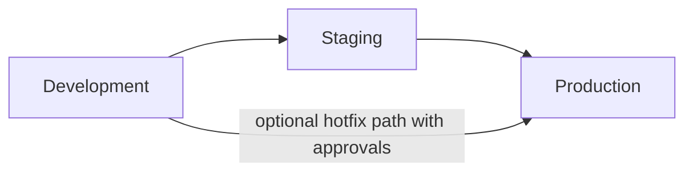

# AWS Environment Promotion Strategy

## Document Control

| Field             | Value                                                      |
| ----------------- | ---------------------------------------------------------- |
| Plan Name         | AWS Environment Promotion Strategy                         |
| Plan ID           | PLATFORM-PLAN-002                                          |
| Version           | 1.0                                                        |
| Status            | Draft                                                      |
| Owner             | Platform Engineering                                       |
| Contributors      | Security, SRE, Release Management, Application Engineering |
| Last Updated      | 2026-05-29                                                 |
| Source References | PLATFORM-DESIGN-001, PLATFORM-PLAN-001                     |

## Objective

Define how application and infrastructure changes move safely from development to staging to production in AWS, with environment isolation, immutable artifacts, approval gates, deployment evidence, and rollback preparation.

## Promotion Principles

- Promote the same built artifacts across environments whenever possible.
- Promote only after environment-specific validation passes.
- Separate application-image promotion from infrastructure-change approval, while tracking both in the same release evidence.
- Treat production as a manual, approval-gated promotion target.
- Keep rollback targets explicit before each production deployment begins.

## Promotion Model

### Environment Roles

| Environment | Role in Promotion Path                                                      |
| ----------- | --------------------------------------------------------------------------- |
| Development | Early integration, contract verification, and non-production validation.    |
| Staging     | Production-like validation environment and release approval gate.           |
| Production  | Customer-facing environment with strongest controls and least human access. |

## Promotion Unit

| Item           | Rule                                                                                                                  |
| -------------- | --------------------------------------------------------------------------------------------------------------------- |
| Application    | Promote by image digest and release manifest, not by mutable image tag.                                               |
| Infrastructure | Promote reviewed Terraform changeset and plan output scoped to the target environment.                                |
| Configuration  | Promote environment-specific non-secret configuration through reviewed vars, while secrets remain environment-native. |
| Evidence       | Carry forward commit SHA, workflow ID, test results, smoke results, and rollback manifest reference.                  |

## Development to Staging Promotion

| Gate               | Requirement                                                                                 |
| ------------------ | ------------------------------------------------------------------------------------------- |
| Code Quality       | `pnpm lint`, `pnpm test`, and `pnpm build` pass for the candidate revision.                 |
| Security           | Dependency, secret, and container scans show no release-blocking findings.                  |
| Infrastructure     | `terraform validate` and reviewed plan output available for staging changes.                |
| Artifact Readiness | Web and API image digests published and recorded in the release manifest.                   |
| Approval           | Platform or release owner approves staging deployment if automation is not fully automatic. |

## Staging Validation Expectations

| Validation Area  | Expectation                                                                                    |
| ---------------- | ---------------------------------------------------------------------------------------------- |
| Health           | ALB target groups healthy, ECS services stable, app readiness endpoints passing.               |
| Functional Smoke | Frontend landing page, login flow, protected-route check, API health, and logout flow succeed. |
| Observability    | Logs, metrics, traces, and alarms receive the new deployment version metadata.                 |
| Security         | TLS, headers, WAF baseline, and secret retrieval all behave as expected.                       |
| Performance      | No obvious regression in latency or saturation compared with previous baseline.                |

## Staging to Production Promotion

| Gate               | Requirement                                                                                   |
| ------------------ | --------------------------------------------------------------------------------------------- |
| Staging Stability  | Staging deployment has remained healthy for the agreed soak period.                           |
| Release Evidence   | Approved release manifest and validation evidence attached to the production change record.   |
| Approval           | Required approvers in GitHub environment and external change-control process if mandated.     |
| Rollback Readiness | Prior production manifest, ECS task definition, and rollback workflow inputs confirmed.       |
| Alert Readiness    | Relevant CloudWatch alarms are active and dashboard links are included in the release record. |

## Hotfix Promotion Guidance

| Topic       | Guidance                                                                                               |
| ----------- | ------------------------------------------------------------------------------------------------------ |
| Eligibility | Restrict to urgent customer-impacting or security issues.                                              |
| Validation  | Run the smallest safe staging or pre-production validation possible before production deploy.          |
| Approval    | Require explicit release and platform approval, with security approval for security-sensitive fixes.   |
| Follow-up   | Backfill normal staging validation and documentation after the hotfix if an abbreviated path was used. |

## Rollback Strategy by Environment

| Environment | Rollback Approach                                                                                               |
| ----------- | --------------------------------------------------------------------------------------------------------------- |
| Development | Roll forward or redeploy previous digest as needed; speed prioritized over ceremony.                            |
| Staging     | Roll back to previous validated manifest and re-run smoke checks.                                               |
| Production  | Roll back to previous approved manifest immediately when stop conditions are met, then open incident follow-up. |

## Stop Conditions for Production Promotion

- ALB target registration does not stabilize within the deployment window.
- Frontend or API readiness endpoints fail.
- Auth journey smoke tests fail.
- 5xx rate, latency, or task crash alarms breach agreed thresholds.
- Required logs, traces, or metrics are missing for the new version.

## Environment Promotion Responsibilities

| Role                    | Responsibility                                                                   |
| ----------------------- | -------------------------------------------------------------------------------- |
| Application Engineering | Ensure app changes are tested, observable, and artifact-ready.                   |
| Platform Engineering    | Own deployment workflows, ECS rollout mechanics, and Terraform promotion safety. |
| Security Engineering    | Review high-risk changes, IAM impacts, secrets handling, and release blockers.   |
| SRE                     | Validate alarms, dashboards, health checks, and rollback readiness.              |
| Release Manager         | Coordinate approvals, release evidence, and communication.                       |

## Environment-Specific Data and Secret Rules

| Topic       | Rule                                                                                              |
| ----------- | ------------------------------------------------------------------------------------------------- |
| Secrets     | Never promote secret values between environments; each environment owns its own secret instances. |
| Data Stores | Production data never flows down to lower environments without approved sanitization processes.   |
| Config      | Keep environment-specific endpoints, domains, and scaling thresholds out of image content.        |
| Access      | Production access is narrower than staging, and staging narrower than development.                |

## Deployment Evidence Checklist

- Commit SHA and release manifest ID.
- Web and API image digests.
- Terraform plan review reference if infra changed.
- Staging smoke and health results.
- Production approver identities.
- Rollback target manifest ID and workflow reference.
- Dashboard and alarm review confirmation.

## Operational Guidance During Promotion

| Time Window   | Guidance                                                                           |
| ------------- | ---------------------------------------------------------------------------------- |
| Before deploy | Confirm incident quiet period, deployment concurrency lock, and on-call awareness. |
| During deploy | Watch ECS events, target health, error rate, and auth-specific dashboards.         |
| After deploy  | Keep heightened monitoring during the agreed hypercare window and log deviations.  |

## Open Questions

- Define the minimum staging soak duration required before production.
- Define whether infrastructure-only and application-only promotions follow separate approval paths.
- Define whether a direct dev-to-production hotfix path is acceptable under current governance.
